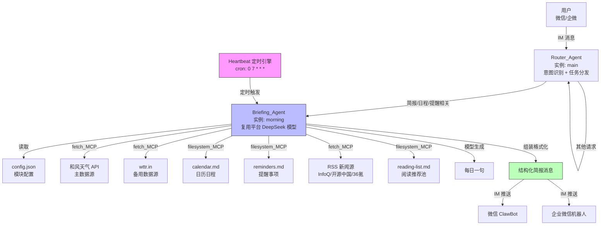
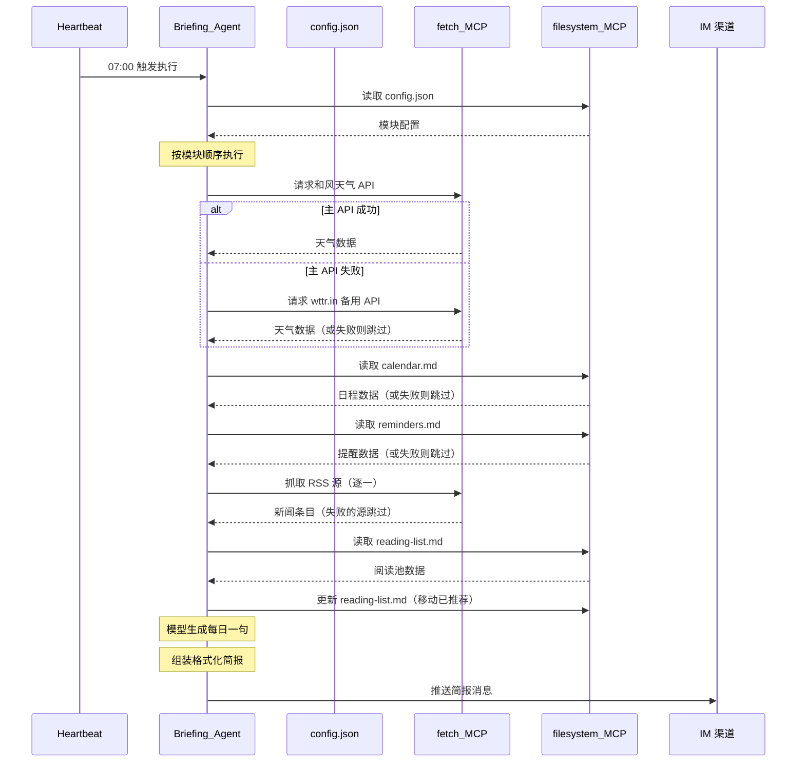
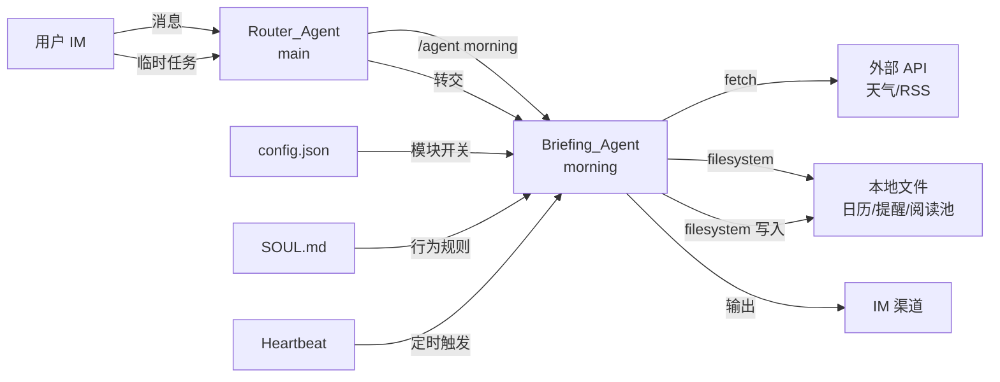

# 技术设计文档：晨间执行官（Morning Briefing）

## 概述

晨间执行官是一个基于 OpenClaw 平台的 Agent 配置项目，而非传统编程项目。系统通过 Heartbeat 定时触发 Briefing_Agent，Agent 利用 MCP 工具（fetch + filesystem）从多个数据源收集信息，由平台已配置的 DeepSeek 大模型汇总生成结构化简报，最终通过微信/企微 IM 渠道推送给用户。

晨间执行官作为多 Agent 体系中的一个专职 Agent 实例（`morning`），与其他 Agent（路由、代码、写作等）共存于同一 OpenClaw 平台，通过独立的 SOUL.md、MCP 权限和数据目录实现隔离。

核心设计理念：
- **零代码开发**：所有功能通过 OpenClaw 配置文件、SOUL.md 人格文件和数据源文件实现
- **模块化数据源**：天气、日历、提醒、新闻、阅读、每日一句六大模块独立开关
- **优雅降级**：任何数据源失败时跳过该模块，不影响其余模块输出
- **安全优先**：文件系统访问路径受限、凭证隔离存储、禁止内网访问
- **多 Agent 隔离**：独立 Agent 实例、独立数据目录、独立 MCP 权限，不干扰其他 Agent

### 产出物清单

| 产出物 | 路径 | 说明 |
|--------|------|------|
| 路由 Agent 人格文件 | `~/.openclaw/agents/main/SOUL.md` | 路由 Agent 的意图识别和任务分发规则 |
| 配置文件 | `/root/morning-briefing/config.json` | 模块开关、数据源、输出配置 |
| 日历文件 | `/root/morning-briefing/calendar.md` | 本地日程数据 |
| 提醒文件 | `/root/morning-briefing/reminders.md` | 关键提醒与截止日期 |
| 阅读池文件 | `/root/morning-briefing/reading-list.md` | 待推荐文章列表 |
| 晨间执行官人格文件 | `~/.openclaw/agents/morning/SOUL.md` | Agent 行为定义与安全边界 |
| 平台配置 | `~/.openclaw/openclaw.json` | Agent 实例、MCP 工具和 Heartbeat 配置 |

---

## 架构

### 系统架构图



### 执行流程



### 安全架构

#### 多 Agent 隔离设计

晨间执行官（`morning`）作为多 Agent 体系中的一个专职实例，隔离通过三个层面实现：

```
┌─────────────────────────────────────────────────────────┐
│  OpenClaw 平台（共享 DeepSeek 模型）                       │
│                                                           │
│  ┌─────────────┐  ┌─────────────┐  ┌──────────────────┐ │
│  │ main Agent   │  │ morning     │  │ 其他 Agent        │ │
│  │ (路由助手)    │  │ Agent       │  │ (代码/写作/...)   │ │
│  │              │  │ (晨间执行官) │  │                   │ │
│  │ SOUL.md      │  │ SOUL.md     │  │ SOUL.md           │ │
│  │ 无 filesystem│  │ filesystem: │  │ filesystem:       │ │
│  │              │  │ /root/      │  │ 各自独立目录       │ │
│  │              │  │ morning-    │  │                   │ │
│  │              │  │ briefing    │  │                   │ │
│  └─────────────┘  └─────────────┘  └──────────────────┘ │
│                                                           │
│  隔离层 1: 独立 Agent 实例（agents.instances）              │
│  隔离层 2: 独立 SOUL.md（行为边界 + 安全规则）              │
│  隔离层 3: 独立 filesystem MCP 路径（数据目录隔离）          │
└─────────────────────────────────────────────────────────┘
```

| 隔离维度 | 实现方式 | 说明 |
|---------|---------|------|
| Agent 实例 | `agents.instances.morning` | 独立的 Agent 配置，与 main/coder/writer 等并列 |
| 人格隔离 | `~/.openclaw/agents/morning/SOUL.md` | 独立的行为定义，只关注简报生成，不处理其他任务 |
| 数据隔离 | filesystem MCP 路径限制 `/root/morning-briefing` | 只能读写自己的数据目录，无法访问其他 Agent 的文件 |
| 模型复用 | 继承 `agents.defaults.model` | 复用平台已配置的 DeepSeek 模型，无需额外配置 |
| 触发隔离 | Heartbeat 任务指定 `agent: "morning"` | 定时任务只触发 morning Agent，不影响其他 Agent |

#### 服务器安全架构

```
┌─────────────────────────────────────────────────────┐
│  云服务器（零公网暴露）                                │
│                                                       │
│  ┌─────────────────────────────────────────────────┐ │
│  │ OpenClaw 进程（systemd 守护）                     │ │
│  │                                                   │ │
│  │  Briefing_Agent                                   │ │
│  │  ├── SOUL.md（含安全边界规则）                      │ │
│  │  ├── fetch_MCP（禁止内网访问）                      │ │
│  │  └── filesystem_MCP（仅 /root/morning-briefing）   │ │
│  │                                                   │ │
│  │  Heartbeat（每天 1-2 次，Token 预算控制）           │ │
│  └─────────────────────────────────────────────────┘ │
│                                                       │
│  /opt/openclaw.env（权限 600，存放 API Key）           │
│  /root/morning-briefing/（数据文件，无凭证）            │
│                                                       │
│  Tailscale Serve → 127.0.0.1:18789                   │
│  安全组：所有入站端口关闭                               │
└─────────────────────────────────────────────────────┘
```

---

## 组件与接口

### 组件总览

本项目的"组件"是 OpenClaw 平台的配置单元，而非传统代码模块。


#### 1. Router_Agent（路由 Agent）

- **实例名**：`main`
- **路径**：`~/.openclaw/agents/main/SOUL.md`
- **职责**：作为用户 IM 消息的统一入口，识别用户意图，将简报/日程/提醒相关请求转交给 Briefing_Agent
- **接口**：接收 IM 消息，通过 `/agent morning` 指令分发任务
- **约束**：不配置任何 MCP 工具，纯提示词路由，不直接执行任务
- **路由规则**：
  - 简报相关（"生成简报"、"今日简报"）→ `/agent morning`
  - 日程相关（"添加日程"、"今天 14:00 开会"）→ `/agent morning`
  - 提醒相关（"提醒我周五前..."）→ `/agent morning`
  - 其他请求 → 自行处理

#### 2. Config_File（配置文件）

- **路径**：`/root/morning-briefing/config.json`
- **职责**：控制所有模块的启用/禁用、数据源 URL、输出渠道
- **接口**：被 Briefing_Agent 通过 filesystem_MCP 读取
- **约束**：JSON 格式，不包含任何真实凭证

#### 3. SOUL_File（晨间执行官人格文件）

- **路径**：`~/.openclaw/agents/morning/SOUL.md`
- **职责**：定义 Briefing_Agent 的身份、执行流程、格式模板和安全边界
- **接口**：OpenClaw 平台在 Agent 初始化时加载
- **约束**：必须包含安全边界规则（禁止内网访问、禁止输出凭证等）

#### 4. Heartbeat 配置

- **路径**：`~/.openclaw/openclaw.json` 中的 `heartbeat` 节点
- **职责**：定义定时触发规则（cron 表达式）和触发 prompt
- **接口**：OpenClaw Heartbeat 引擎读取并按时触发
- **约束**：频率合理（每天 2-3 次：早 7 点晨报 + 晚 7 点日报/周报），配合 `maxTokensPerDay` 预算控制

#### 5. MCP 工具配置

- **路径**：`~/.openclaw/openclaw.json` 中的 `mcpServers` 节点
- **职责**：声明 Agent 可用的外部工具
- **工具清单**：

| MCP 工具 | 用途 | 安全约束 |
|----------|------|---------|
| fetch | 调用天气 API、抓取 RSS 源 | SOUL.md 禁止访问内网地址 |
| filesystem | 读写本地 Markdown 文件 | 路径限制为 `/root/morning-briefing` |

#### 6. 数据源文件

| 文件 | 格式 | 读写模式 | 说明 |
|------|------|---------|------|
| `calendar.md` | Markdown | 读写 | 按日期分节的日程列表，Agent 可追加临时任务 |
| `reminders.md` | Markdown | 读写 | 按时间段分组的提醒条目，Agent 可追加临时提醒 |
| `reading-list.md` | Markdown | 读写 | 分"未读"和"已推荐"两部分 |

### 模块间交互



---

## 数据模型

### config.json 结构

```json
{
    "user": {
        "name": "string — 用户名称",
        "city": "string — 所在城市（用于天气查询）",
        "timezone": "string — 时区，如 Asia/Shanghai",
        "language": "string — 语言，如 zh-CN"
    },
    "schedule": {
        "morning": "string — 晨间简报 cron 表达式，默认 0 7 * * *",
        "evening": "string — 晚间日报/周报 cron 表达式，默认 0 19 * * *"
    },
    "modules": {
        "weather": {
            "enabled": "boolean — 是否启用天气模块",
            "primary": {
                "provider": "string — 主数据源名称",
                "api": "string — API URL（Key 通过环境变量注入）"
            },
            "fallback": {
                "provider": "string — 备用数据源名称",
                "api": "string — 备用 API URL"
            }
        },
        "calendar": {
            "enabled": "boolean",
            "source": "string — 数据源类型：local | api",
            "file": "string — 本地文件路径（source=local 时）"
        },
        "reminders": {
            "enabled": "boolean",
            "file": "string — 提醒文件路径"
        },
        "news": {
            "enabled": "boolean",
            "sources": [
                {
                    "name": "string — 源名称",
                    "url": "string — RSS URL",
                    "filter": "string — 逗号分隔的关键词（可为空）"
                }
            ],
            "maxItems": "number — 最多选取的新闻条数"
        },
        "reading": {
            "enabled": "boolean",
            "file": "string — 阅读池文件路径",
            "maxItems": "number — 每次推荐的文章数"
        },
        "quote": {
            "enabled": "boolean",
            "style": "string — 生成风格描述"
        }
    },
    "output": {
        "format": "string — 输出格式：structured",
        "pushTo": "string — 推送渠道：wechat | wecom"
    }
}
```

### calendar.md 格式

```markdown
# 本周日程

## YYYY-MM-DD（星期X）
- HH:MM 事项描述（备注信息）
- HH:MM 事项描述

## YYYY-MM-DD（星期X）
- 无安排，休息日
```

**解析规则**：
- 二级标题（`##`）为日期行，格式 `YYYY-MM-DD（星期X）`
- 列表项为日程条目，格式 `HH:MM 事项描述（可选备注）`
- Agent 匹配当天日期的二级标题，提取其下所有列表项

### reminders.md 格式

```markdown
# 关键提醒

## 本周
- 事项描述 YYYY-MM-DD截止
- 事项描述 YYYY-MM-DD到期

## 长期
- 每月 X 号提交月报
- 每季度末更新安全检查清单
```

**解析规则**：
- 列表项中包含日期信息（`YYYY-MM-DD` 或 `X月X日`）
- Agent 筛选 3 天内（含当天）到期的条目
- 按截止日期从近到远排序

### reading-list.md 格式

```markdown
# 推荐阅读池

未读：
- 《文章标题》 https://example.com/url
- 《文章标题》 https://example.com/url

已推荐：
- 《文章标题》 https://example.com/url
```

**状态流转**：
- Agent 从"未读"部分随机选取文章
- 选中后将该条目从"未读"移动到"已推荐"
- 当"未读"部分为空时，提示用户补充

### 简报输出格式

```
☀️ 晨间简报 · {月}月{日}日 {星期}

🌤 天气：{城市} {温度}°C {状况}，{建议}

📅 今日日程（{N} 项）：
· {时间} {事项}（{备注}）

⚡ 关键提醒：
· {提醒内容}

📰 行业热点（{N} 条）：
· {标题} — {一句话摘要}

📖 推荐阅读：
· 《{标题}》{链接}

💪 今日一句：
"{句子}"
```

### openclaw.json 关键配置结构

```json
{
    "agents": {
        "defaults": {
            "model": "已配置的 DeepSeek 模型（平台级，所有 Agent 共享）"
        },
        "instances": {
            "main": {
                "name": "路由助手",
                "note": "主入口，意图识别和任务分发，无 MCP 工具"
            },
            "morning": {
                "name": "晨间执行官",
                "note": "专职 Agent，复用 defaults.model"
            }
        }
    },
    "mcpServers": {
        "fetch": {
            "command": "npx",
            "args": ["-y", "@modelcontextprotocol/server-fetch"]
        },
        "filesystem": {
            "command": "npx",
            "args": [
                "-y", "@modelcontextprotocol/server-filesystem",
                "/root/morning-briefing"
            ]
        }
    },
    "heartbeat": {
        "enabled": true,
        "tasks": [
            {
                "name": "晨间简报",
                "cron": "按 config.json schedule.morning 配置，默认 0 7 * * *",
                "agent": "morning",
                "prompt": "string — 触发 Agent 执行简报流程的指令"
            },
            {
                "name": "晚间日报/周报",
                "cron": "按 config.json schedule.evening 配置，默认 0 19 * * *",
                "agent": "morning",
                "prompt": "string — 判断今天是否周五：周五生成周报，其他日生成日报"
            }
        ]
    }
}
```

> 注意：`agents.instances.morning` 声明晨间执行官为独立 Agent 实例。Heartbeat 任务通过 `agent: "morning"` 指定只触发该实例，不影响 main 或其他 Agent。fetch MCP 为平台共享工具，filesystem MCP 的路径参数实现了数据目录隔离。

### 晚间日报输出格式（需求 14）

```
🌙 今日回顾 · {月}月{日}日

✅ 已完成：
· {事项}

⏳ 未完成：
· {事项}

📅 明日预览：
· {时间} {事项}

💤 晚安提醒：
"{一句话}"
```

### 周五周报输出格式（需求 15）

```
📋 本周工作周报 · {月}月{日}日

一、本周目标总结
1. 已完成【项目/任务/功能模块】的研发/测试；
2. 进行中【项目/任务/功能模块】，目前完成X%，预计下周完成X%；
3. 配合XX团队解决了XX问题；
4. 计划外新增任务，任务来源及完成百分比。

二、下周工作目标
1. 【项目/任务/功能模块】，预计完成时间，优先级；
   （对无法完全交付的需求，拆分为阶段性成果）

三、周学习总结
1. 学习与提升：技术学习、培训或交流研讨活动。
```

### 团队版配置扩展（可选，需求 13）

```json
{
    "teams": [
        {
            "name": "string — 团队名称",
            "focus": "string — 关注领域关键词",
            "cron": "string — 独立的 cron 表达式",
            "pushTo": "string — 推送渠道"
        }
    ]
}
```


---

## 正确性属性（Correctness Properties）

*正确性属性是系统在所有有效执行中都应保持为真的特征或行为——本质上是对系统应该做什么的形式化陈述。属性是人类可读规格说明与机器可验证正确性保证之间的桥梁。*

> 注意：本项目是 OpenClaw Agent 配置项目，大部分验收标准描述的是 Agent 行为（由 SOUL.md 指令和模型能力控制），不适合传统的自动化测试。以下属性聚焦于可编程验证的配置文件结构、输出格式和数据完整性约束。

### Property 1: config.json Schema 验证

*对于任意* 有效的 config.json 文件，它应该包含 `user`、`modules`、`output` 三个顶层字段，且 `modules` 下的每个模块对象都应该包含 `enabled` 布尔字段。

**Validates: Requirements 10.1, 10.2**

### Property 2: config.json 凭证安全

*对于任意* config.json 文件内容，不应该包含匹配常见 API Key 模式（如 `sk-`、`ghp_`、`key=`后跟长字符串等）的真实凭证信息。

**Validates: Requirements 10.4**

### Property 3: 简报模块顺序与 emoji 标识

*对于任意* 简报输出，启用模块的 emoji 标识（🌤📅⚡📰📖💪）应该按照天气、日程、提醒、热点、阅读、每日一句的固定顺序出现，且每个启用的模块都有对应的 emoji 标识。

**Validates: Requirements 8.1, 8.2**

### Property 4: 简报标题行格式

*对于任意* 简报输出，第一行应该匹配格式 `☀️ 晨间简报 · {月}月{日}日 {星期}`，其中月、日为有效数字，星期为有效的中文星期表示。

**Validates: Requirements 8.3**

### Property 5: 简报模块行数限制

*对于任意* 简报输出中的每个模块，其内容行数不应超过 5 行。

**Validates: Requirements 8.4**

### Property 6: 阅读池状态流转不变量

*对于任意* reading-list.md 文件，在推荐操作前后，"未读"部分的文章数应减少（减少量等于被推荐的文章数），"已推荐"部分的文章数应增加相同数量，且文章总数保持不变。

**Validates: Requirements 6.3**

### Property 7: 每日一句字数限制

*对于任意* 生成的每日一句内容，其汉字字符数不应超过 30 个。

**Validates: Requirements 7.2**

### Property 8: 晚间回顾结构完整性

*对于任意* 晚间回顾输出（当晚间回顾功能启用时），应该包含已完成、未完成、明日预览和晚安提醒四个部分。

**Validates: Requirements 12.5**

### Property 9: 团队版配置结构验证

*对于任意* 启用团队版功能的 config.json，`teams` 数组中的每个元素都应该包含团队名称（`name`）、关注领域（`focus`）和推送渠道（`pushTo`）字段。

**Validates: Requirements 13.1**

---

## 错误处理

本项目的错误处理策略遵循"优雅降级"原则——任何单一数据源的失败不应阻止整体简报的生成。

### 错误处理矩阵

| 错误场景 | 处理策略 | 对应需求 |
|---------|---------|---------|
| config.json 不存在或格式无效 | 记录错误日志，终止本次简报生成 | 1.4 |
| 和风天气 API 请求失败 | 回退到 wttr.in 备用 API | 2.2 |
| 主备天气 API 均失败 | 跳过天气模块，继续生成其余模块 | 2.4 |
| calendar.md 不存在或读取失败 | 跳过日历模块，继续生成其余模块 | 3.4 |
| 当天无日程条目 | 显示"今日无安排" | 3.3 |
| reminders.md 不存在或读取失败 | 跳过提醒模块，继续生成其余模块 | 4.4 |
| 单个 RSS 源抓取失败 | 跳过该源，继续处理其余 RSS 源 | 5.4 |
| 所有 RSS 源均失败 | 跳过新闻模块，继续生成其余模块 | 5.5 |
| reading-list.md 不存在或读取失败 | 跳过阅读模块，继续生成其余模块 | 6.5 |
| 阅读池"未读"部分为空 | 显示"阅读池已空，请补充新文章" | 6.4 |
| 简报推送失败 | 记录推送失败的错误日志 | 9.2 |

### 错误处理在 SOUL.md 中的实现

所有错误处理逻辑通过 SOUL.md 中的行为指令实现，而非代码逻辑。关键指令：

```markdown
## 错误处理原则
- 如果某个数据源获取失败，跳过该模块，不要报错给用户
- 不要无限重试失败的数据源
- config.json 是唯一的硬依赖——如果它不可用，终止执行
- 其他所有数据源都是软依赖——失败时优雅跳过
```

### 安全相关错误处理

| 安全场景 | 处理策略 | 对应需求 |
|---------|---------|---------|
| fetch 请求指向内网地址 | SOUL.md 禁止规则阻止 | 11.2 |
| Agent 尝试输出凭证信息 | SOUL.md 禁止规则阻止 | 11.3 |
| filesystem 访问超出限定目录 | MCP 配置路径限制阻止 | 11.1 |

---

## 测试策略

### 测试方法概述

由于本项目是 OpenClaw Agent 配置项目（非传统编程项目），测试策略分为两个层面：

1. **配置验证测试**（可自动化）：验证配置文件结构、数据格式和安全约束
2. **端到端验收测试**（手动）：通过 IM 渠道手动触发并验证 Agent 行为

### 属性测试（Property-Based Testing）

使用 Python + Hypothesis 库进行属性测试，验证配置文件和输出格式的正确性。

**配置要求**：
- 测试库：Hypothesis（Python）
- 每个属性测试最少运行 100 次迭代
- 每个测试用注释标注对应的设计属性

**属性测试清单**：

| 属性 | 测试描述 | 标签 |
|------|---------|------|
| Property 1 | 随机生成 config.json 变体，验证 schema 结构 | Feature: morning-briefing, Property 1: config.json Schema 验证 |
| Property 2 | 随机注入凭证模式字符串到 config.json，验证检测能力 | Feature: morning-briefing, Property 2: config.json 凭证安全 |
| Property 3 | 随机生成模块启用组合，验证输出中 emoji 顺序 | Feature: morning-briefing, Property 3: 简报模块顺序与 emoji 标识 |
| Property 4 | 随机生成日期，验证标题行格式匹配 | Feature: morning-briefing, Property 4: 简报标题行格式 |
| Property 5 | 随机生成模块内容，验证行数限制 | Feature: morning-briefing, Property 5: 简报模块行数限制 |
| Property 6 | 随机生成阅读池和推荐数量，验证状态流转不变量 | Feature: morning-briefing, Property 6: 阅读池状态流转不变量 |
| Property 7 | 随机生成中文短句，验证字数限制 | Feature: morning-briefing, Property 7: 每日一句字数限制 |
| Property 8 | 随机生成晚间回顾内容，验证四部分结构 | Feature: morning-briefing, Property 8: 晚间回顾结构完整性 |
| Property 9 | 随机生成团队配置，验证必要字段存在 | Feature: morning-briefing, Property 9: 团队版配置结构验证 |

### 单元测试

单元测试聚焦于具体示例和边界情况：

| 测试场景 | 类型 | 说明 |
|---------|------|------|
| Heartbeat cron 表达式为 `0 7 * * *` | example | 验证需求 1.1 |
| filesystem MCP 路径为 `/root/morning-briefing` | example | 验证需求 11.1 |
| SOUL.md 包含内网地址禁止规则 | example | 验证需求 11.2 |
| SOUL.md 包含凭证输出禁止规则 | example | 验证需求 11.3 |
| /opt/openclaw.env 文件权限为 600 | example | 验证需求 11.5 |
| config.json 为有效 JSON 格式 | example | 验证需求 10.3 |
| 晚间回顾 cron 表达式为 `0 22 * * *` | example | 验证需求 12.1 |
| 阅读池"未读"为空时的提示文案 | edge-case | 验证需求 6.4 |

### 端到端验收测试（手动）

通过 IM 渠道手动触发 Agent 执行，逐项验证：

| 验证项 | 验证方法 |
|--------|---------|
| 天气模块 | 检查简报中是否包含正确城市的天气信息 |
| 日历模块 | 检查简报中是否匹配当天日期的日程 |
| 提醒模块 | 检查简报中是否包含近期到期的提醒 |
| 新闻模块 | 检查简报中是否包含 RSS 源的新闻条目 |
| 阅读模块 | 检查简报中是否包含推荐文章，且 reading-list.md 已更新 |
| 每日一句 | 检查简报中是否包含中文短句 |
| 格式完整性 | 检查简报整体格式是否清晰、一屏可读 |
| 降级能力 | 故意断开某个数据源，验证简报是否正常生成（跳过该模块） |
| 安全边界 | 尝试让 Agent 访问限定目录外的文件，验证是否被阻止 |

